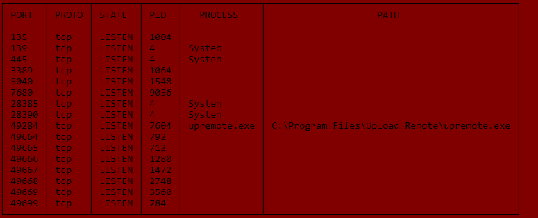

# portswarden 🛡️

> Find and free Windows ports — kill `EADDRINUSE` in one command.

A small, honest CLI tool built for Windows developers who are tired of:

    Error: listen EADDRINUSE: address already in use :::3000

and then having to type:

    netstat -ano | findstr :3000
    taskkill /PID 1234 /F

`portswarden` turns that into:

    portswarden kill 3000

That's it.

---

## 👋 About the creator

Hi, I'm **Waseem Khan**, 23 years old. I love **vibe coding** — building real things, learning by doing, and shipping rather than waiting for the perfect plan.

This project is **vibe-coded**: it was created with help from **DeepSeek AI**, built in one evening on a Windows machine, with a notepad, a terminal, and a whole lot of "let's just try it."

If you're also a vibe coder — this repo is proof you can ship a real tool in a day.

---

## ⚡ What it does

| Command | What it does |
|---|---|
| `portswarden list` | Show every TCP/UDP port currently listening, with the process name and path |
| `portswarden list -p 3000` | Show only what's using port 3000 |
| `portswarden kill 3000` | Kill whatever is holding port 3000 |
| `portswarden watch 3000` | Keep port 3000 free — auto-kills anything that grabs it |
| `portswarden excluded` | Show Windows-reserved TCP port ranges (the hidden reason a port "won't open") |

---

## 🎯 Why not just use `netstat`?

You can. But:

| Task | netstat way | portswarden |
|---|---|---|
| Find what's on :3000 | `netstat -ano \| findstr :3000`, then look up the PID manually | `portswarden list -p 3000` |
| Kill it | `taskkill /PID x /F` | `portswarden kill 3000` |
| Know why :3000 is *always* taken | you don't | `portswarden excluded` |
| Keep :3000 free while coding | impossible | `portswarden watch 3000` |

The `excluded` command is the real differentiator. Windows quietly reserves random port ranges for Hyper-V, WSL2, Docker, and other services. Those ports will refuse to bind no matter what you do. Almost no port tool shows you this.

---

## 📦 Install

### Option 1 — Download the `.exe`

Grab the latest `portswarden.exe` from the [Releases page](../../releases) and put it anywhere on your `PATH`.

### Option 2 — Build from source

Requires Go 1.22+:

    git clone https://github.com/khpalwatan/portswarden.git
    cd portswarden
    go build -o portswarden.exe .
    ./portswarden.exe list

---

## 🚀 Usage

    portswarden list
    portswarden list -p 3000
    portswarden kill 3000
    portswarden watch 3000
    portswarden excluded

Every command has `--help`:

    portswarden kill --help

---

## 🧠 How it works

At its core, `portswarden` does three things:

1. **Reads listening ports** using [`gopsutil`](https://github.com/shirou/gopsutil), a cross-platform Go library that wraps system calls (on Windows it uses the same data `netstat` uses, but returns structured results instead of text).
2. **Maps each port to a process** by looking up the PID with `process.NewProcess(pid)`, then reading its name and executable path.
3. **Kills by port** by shelling out to Windows' `taskkill /PID <pid> /F`.

The `excluded` command is a thin wrapper around:

    netsh int ipv4 show excludedportrange protocol=tcp

and parses the output to show you the reserved ranges.

That's the whole thing. No services, no background daemons, no config files.

---

## 🛠️ Tech stack

| Library | What it does |
|---|---|
| [`spf13/cobra`](https://github.com/spf13/cobra) | CLI framework — subcommands, flags, help text |
| [`shirou/gopsutil/v3`](https://github.com/shirou/gopsutil) | Cross-platform port + process info |
| [`olekukonko/tablewriter`](https://github.com/olekukonko/tablewriter) | Pretty table output |
| [`fatih/color`](https://github.com/fatih/color) | Colored terminal output |
| [`akavel/rsrc`](https://github.com/akavel/rsrc) | Embeds the app icon into the `.exe` |

Language: **Go** — because it compiles to a single `.exe` with zero runtime dependencies. Users just download and run.

---

## 🗺️ Roadmap

- [x] `list` command
- [x] `kill` command
- [x] `watch` command
- [x] `excluded` command
- [x] Icon embedded in the `.exe`
- [x] GitHub Actions — auto-build `.exe` on every release
- [ ] Interactive TUI mode (arrow keys to select and kill)
- [ ] Docker-aware process names
- [ ] `winget` / `scoop` manifests
- [ ] Linux + macOS support

---

## 🤝 Contributing

This is a beginner-friendly project. If you're learning Go or vibe-coding your first tool — fork it, break it, improve it, send a PR. No gatekeeping.

---

## 📄 License

MIT — do whatever you want. See [LICENSE](LICENSE).

---

Built with 🖤 by [@khpalwatan](https://github.com/khpalwatan) — vibe coded, one evening, one terminal.